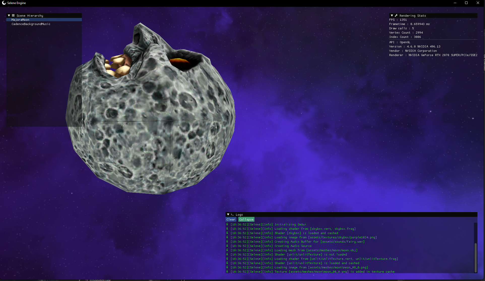

# Selene
Game Engine written in modern C++ 

## Projects description

### Selene
+ It's the game engine itself
+ Designed to be API agnostic / Cross-platform 
+ Currently working with OpenGL (4.5 with full DSA support) and Windows 64
+ I plan to add Vulkan/DX11/DX12/Metal implementation in the future

### SeleneGame
+ A sandbox with some debug info using imgui

## Media
https://www.youtube.com/watch?v=L5xxnawcFio

## References
+ [The Cherno](https://www.youtube.com/channel/UCQ-W1KE9EYfdxhL6S4twUNw)
+ https://learnopengl.com
+ http://www.opengl-tutorial.org
+ http://ogldev.atspace.co.uk
+ https://docs.gl/
